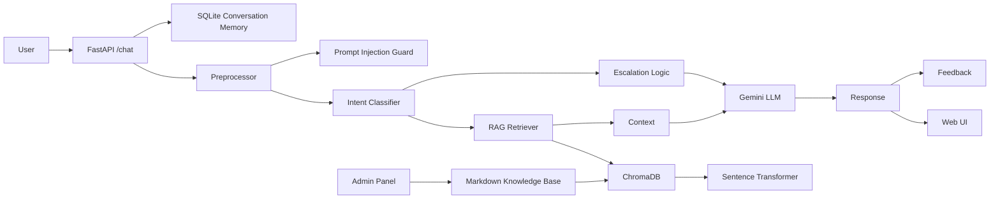

# SmartAssist Architecture

```mermaid
flowchart LR
A[User] --> B[FastAPI /chat]
B --> C[Preprocessor]
C --> D[Intent Classifier]
C --> E[Prompt Injection Guard]
D --> F[RAG Retriever]
F --> G[ChromaDB]
G --> H[Sentence Transformer]
F --> I[Context]
I --> J[Gemini LLM]
D --> K[Escalation Logic]
K --> J
J --> L[Response]
L --> M[Web UI]
B --> N[SQLite Conversation Memory]
L --> O[Feedback]
P[Admin Panel] --> Q[Markdown Knowledge Base]
Q --> G
```
